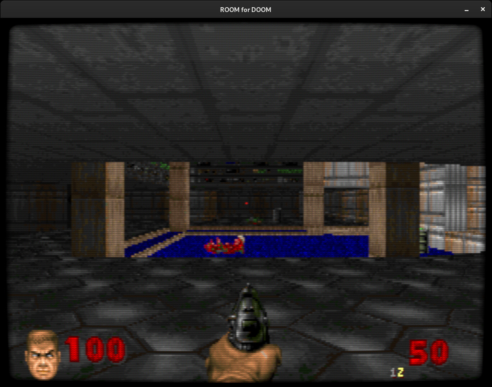
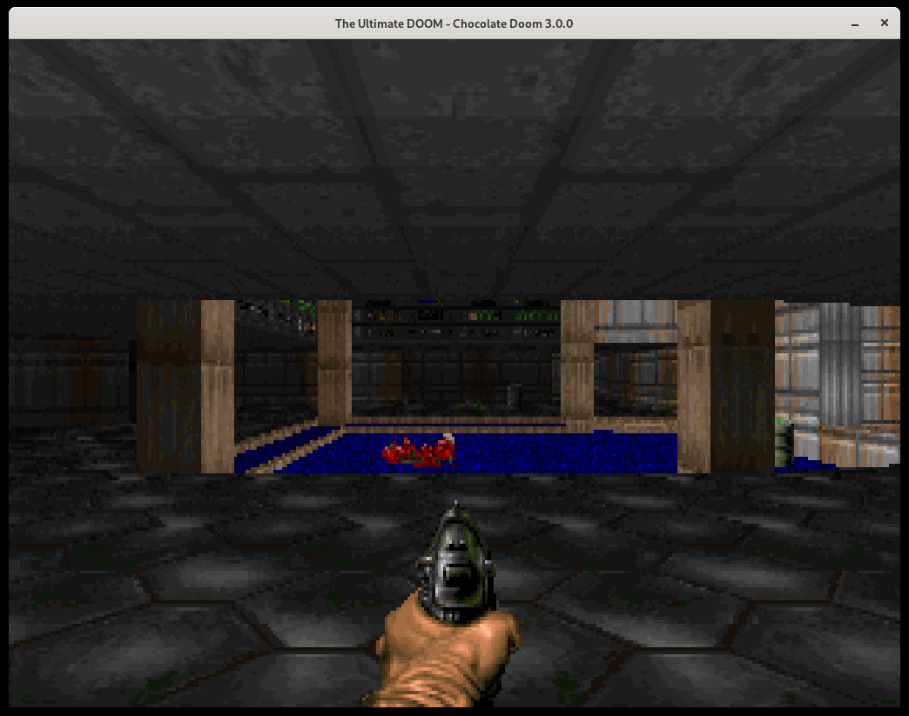
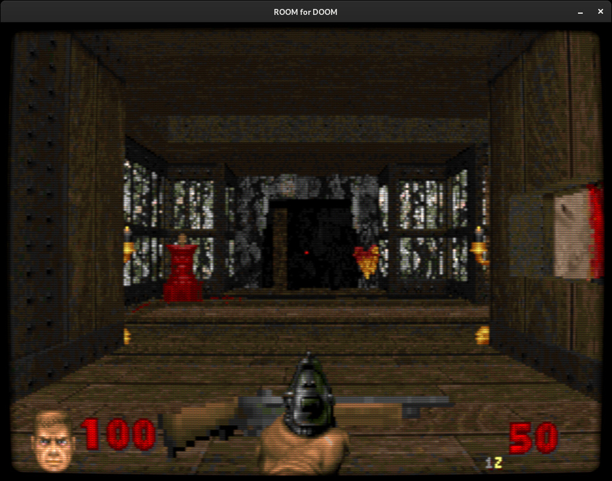
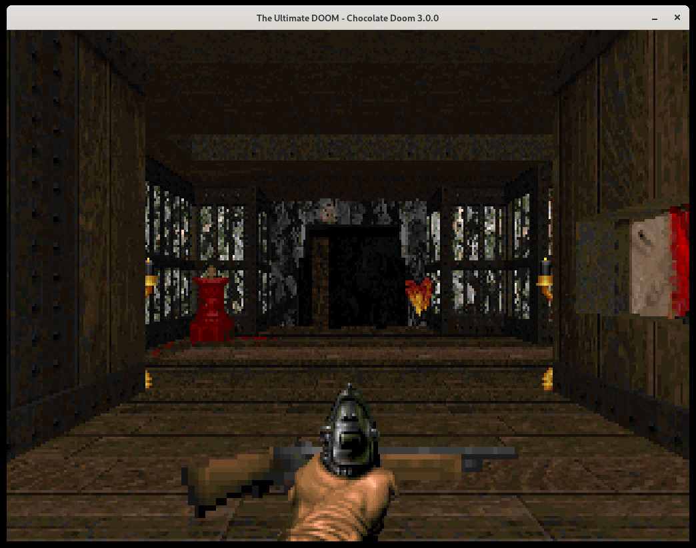

# ROOM - Rusty Doom

This is a personal project to rewrite Doom C in Rust. Where possible I try to keep the original
Doom behaviour intact, while also making some improvements. I am also trying to document everything
as I go along.

I originally started by following along with [https://github.com/amroibrahim/DIYDoom](https://github.com/amroibrahim/DIYDoom)

Take a look at how [I progressed through](https://ljones.dev/blog/room4doom-20220529/)

Be warned that because the initial code is transliterated as much as possible from the Doom C except
where that causes issues, many things may not be optimal or idiomatic rust. There will be things like
dodgy casts, unrequired `as` casts, unused fields or args, lots of `unsafe` blocks etc. The main thing
I tried to do was bring up the game to a fully playable state *fast*, and *then* begin to optimise,
refactor, or redesign components - it is much easier to do when you have a working playable state to
begin with that can be used for play-testing and such.

The code can dramatically change as I learn new or better ways to do things.

## Goals

Not sure. I started this as a personal project to pretty much try and rewrite Doom in Rust only.
But, as time went on and I learned more of the engine I saw more areas I could improve, or things
that would maybe work well as split-out crates (gameplay for example). I think the final goal boils
down to the following points:

- Try to be as close as possible to original Doom source
- But try to improve things where possible while somehow keeping classic behaviour
- Compartmentalise the engine in to crates where possible, such that:
  - Sound is independant
  - Rendering (each renderer/drawer; player view, status, hud etc) and be swapped out
  - Expose the minimal possible API to gameplay crate such that it could be used
    on its own to drive Doom, with all non-gamplay (read, level loaded and playing)
    related stuff is delegated out
- Boom improvements compatibility
- Add an example isometric renderer
- Hi-Res mode
- Widescreen modes

And maybe write a book on all I've learned about writing a Doom engine.

### Implemented (so far):

- Software rendering
- Menus (not all items complete though)
- HUD + statusbar (improved)
- Intermission and finales.
- Lighting (diminished, animated)
- Movers (environment things, like doors, platforms)
- Thinkers (used for the above + demons)
- Thinker states and changing
- Sprites
- Input
- Cheats (partial for debugging)
- CLI options (use `--help`)
- Basic surface shaders (ROOM renders to a surface that a shader can manipulate)
- Sound
- Music
- Shooting
- Item pickup and use
- 99% of gameplay (Need to do Doom II boss and pain elemental then it's done)

**Some of the improvements I've made (so far):**

- BSP used for collisions (Doom used the blockmap)
- BSP used for aiming, shooting, and LoS (Doom used the blockmap)
- Floats instead of fixed-point (this may cause slight behaviour changes)
- Hi-Res mode

## TODO:

I keep a list of things to do in [TODO](./TODO.md). It's worth looking at I guess because
it serves sort of as a list of major points of interest, a kinda-sorta changelog, and a
snapshot of where the engine state is right now.

**Functionality TODO:**

- Automap
- Save/load game

## Building

I use and develop on Linux exclusively so although I once did a Windows build I don't maintain it.

- Bundled SDL2: `cargo build --features "sdl2-bundled"`
- Distro SDL2: `cargo build`

The distro requires SDL2 + SDL2-mixer to be installed along with the related dev packages including `alsa-lib-devel` and `pulseaudio-libs-devel`.
Music support requires fluidsynth or timidity to be installed along with files in the `data/sound/`
being installed to `~/.local/share/room4doom/sound/`.

## User Config

On start a user config file is created at `~/.config/room4doom/user.toml`. This can be edited by hand.

Options set via CLI are saved to the user-config file.

Starting `room4doom` without CLI options *after* previously setting options then exiting will load
those options (as saved to `~/.config/room4doom/user.toml`).

Use `room4doom --help` to see all available CLI options.

## Documentation

I've not been as good as I should be at this because I've been on a mad rush to implement
as much as I can. Plus the nature of doing large blocks hasn't helped. [misc/code-review/](./misc/code-review/)
has a semi-broken out series of files where I try to note things of interest, or even write
a full code review. Each of these files and additions will be updated and fleshed out over time.

The magnificance of rust/cargo being able to produce a static website full of code documentation
means that I try to maintain docs somewhat at [https://flukejones.gitlab.io/room4doom/room4doom/index.html](https://flukejones.gitlab.io/room4doom/room4doom/index.html).
Browsing [wad](https://flukejones.gitlab.io/room4doom/wad/index.html) is a good example of what I would like
to achieve here.

## Screenshots

**Comparison:**




**SI6IL**





# License change

This work is licensed as **MIT**.

The primary source of information for this project is the 3DO source dump by Burger Becky, with the linux-doom source being used as a reference only when the 3DO source was not sufficient. Linux-Doom was sourced for comments, some Doom II enemy functions, and some of the seg rendering.

The original Linux Doom source as licensed under the DSL was used as an educational resource as stated under clause 2 of the DSL.

Where possible, relevant comments in the "Source Code" are kept as historical artefacts.

### DSL for reference

```
 LIMITED USE SOFTWARE LICENSE AGREEMENT

 This Limited Use Software License Agreement (the "Agreement")
is a legal agreement between you, the end-user, and Id Software, Inc.
("ID"). By downloading or purchasing the software material, which
includes source code (the "Source Code"), artwork data, music and
software tools (collectively, the "Software"), you are agreeing to
be bound by the terms of this Agreement. If you do not agree to the
terms of this Agreement, promptly destroy the Software you may have
downloaded or copied.

ID SOFTWARE LICENSE

1. Grant of License. ID grants to you the right to use the
Software. You have no ownership or proprietary rights in or to the
Software, or the Trademark. For purposes of this section, "use" means
loading the Software into RAM, as well as installation on a hard disk
or other storage device. The Software, together with any archive copy
thereof, shall be destroyed when no longer used in accordance with
this Agreement, or when the right to use the Software is terminated.
You agree that the Software will not be shipped, transferred or
exported into any country in violation of the U.S. Export
Administration Act (or any other law governing such matters) and that
you will not utilize, in any other manner, the Software in violation
of any applicable law.

2. Permitted Uses. For educational purposes only, you, the
end-user, may use portions of the Source Code, such as particular
routines, to develop your own software, but may not duplicate the
Source Code, except as noted in paragraph 4. The limited right
referenced in the preceding sentence is hereinafter referred to as
"Educational Use." By so exercising the Educational Use right you
shall not obtain any ownership, copyright, proprietary or other
interest in or to the Source Code, or any portion of the Source
Code. You may dispose of your own software in your sole discretion.
With the exception of the Educational Use right, you may not
otherwise use the Software, or an portion of the Software, which
includes the Source Code, for commercial gain.

3. Prohibited Uses: Under no circumstances shall you, the
end-user, be permitted, allowed or authorized to commercially exploit
the Software. Neither you nor anyone at your direction shall do any
of the following acts with regard to the Software, or any portion
thereof:

 Rent;

 Sell;

 Lease;

 Offer on a pay-per-play basis;

 Distribute for money or any other consideration; or

 In any other manner and through any medium whatsoever
commercially exploit or use for any commercial purpose.

Notwithstanding the foregoing prohibitions, you may commercially
exploit the software you develop by exercising the Educational Use
right, referenced in paragraph 2. hereinabove.

4. Copyright. The Software and all copyrights related thereto
(including all characters and other images generated by the Software
or depicted in the Software) are owned by ID and is protected by
United States copyright laws and international treaty provisions.
Id shall retain exclusive ownership and copyright in and to the
Software and all portions of the Software and you shall have no
ownership or other proprietary interest in such materials. You must
treat the Software like any other copyrighted material. You may not
otherwise reproduce, copy or disclose to others, in whole or in any
part, the Software. You may not copy the written materials
accompanying the Software. You agree to use your best efforts to
see that any user of the Software licensed hereunder complies with
this Agreement.

5. NO WARRANTIES. ID DISCLAIMS ALL WARRANTIES, BOTH EXPRESS
IMPLIED, INCLUDING BUT NOT LIMITED TO, IMPLIED WARRANTIES OF
MERCHANTABILITY AND FITNESS FOR A PARTICULAR PURPOSE WITH RESPECT
TO THE SOFTWARE. THIS LIMITED WARRANTY GIVES YOU SPECIFIC LEGAL
RIGHTS. YOU MAY HAVE OTHER RIGHTS WHICH VARY FROM JURISDICTION TO
JURISDICTION. ID DOES NOT WARRANT THAT THE OPERATION OF THE SOFTWARE
WILL BE UNINTERRUPTED, ERROR FREE OR MEET YOUR SPECIFIC REQUIREMENTS.
THE WARRANTY SET FORTH ABOVE IS IN LIEU OF ALL OTHER EXPRESS
WARRANTIES WHETHER ORAL OR WRITTEN. THE AGENTS, EMPLOYEES,
DISTRIBUTORS, AND DEALERS OF ID ARE NOT AUTHORIZED TO MAKE
MODIFICATIONS TO THIS WARRANTY, OR ADDITIONAL WARRANTIES ON BEHALF
OF ID.

 Exclusive Remedies. The Software is being offered to you
free of any charge. You agree that you have no remedy against ID, its
affiliates, contractors, suppliers, and agents for loss or damage
caused by any defect or failure in the Software regardless of the form
of action, whether in contract, tort, includinegligence, strict
liability or otherwise, with regard to the Software. This Agreement
shall be construed in accordance with and governed by the laws of the
State of Texas. Copyright and other proprietary matters will be
governed by United States laws and international treaties. IN ANY
CASE, ID SHALL NOT BE LIABLE FOR LOSS OF DATA, LOSS OF PROFITS, LOST
SAVINGS, SPECIAL, INCIDENTAL, CONSEQUENTIAL, INDIRECT OR OTHER
SIMILAR DAMAGES ARISING FROM BREACH OF WARRANTY, BREACH OF CONTRACT,
NEGLIGENCE, OR OTHER LEGAL THEORY EVEN IF ID OR ITS AGENT HAS BEEN
ADVISED OF THE POSSIBILITY OF SUCH DAMAGES, OR FOR ANY CLAIM BY ANY
OTHER PARTY. Some jurisdictions do not allow the exclusion or
limitation of incidental or consequential damages, so the above
limitation or exclusion may not apply to you.
```
