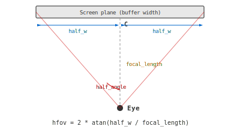
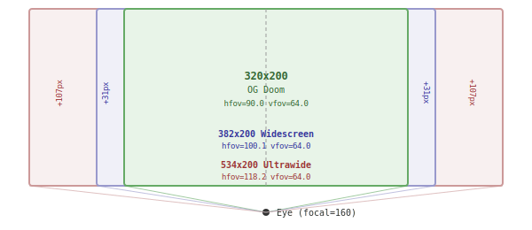
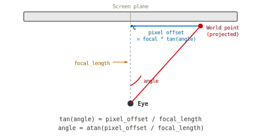
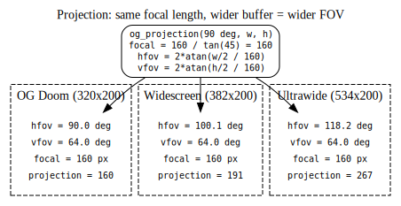

# Projection & FOV in Room4Doom

How the renderer maps 3D world geometry to screen pixels, and how widescreen
support works without distorting the original Doom proportions.

## The pinhole camera model

Doom's renderer (and Room4Doom's) works like a pinhole camera. An imaginary
screen plane sits at a fixed distance from the player's eye. Rays from the eye
pass through each pixel of the screen and into the world. The distance from the
eye to the screen plane is the **focal length**.



The angle from the center ray to the left or right edge is:

    half_angle = atan(half_width / focal_length)

The total horizontal field of view is twice that:

    hfov = 2 * atan(half_width / focal_length)

## OG Doom's values

OG Doom renders into a 320x200 buffer with a 90-degree horizontal FOV:

    half_width   = 160 pixels
    hfov         = 90 degrees
    half_angle   = 45 degrees
    focal_length = half_width / tan(half_angle)
                 = 160 / tan(45)
                 = 160 / 1.0
                 = 160 pixels

OG Doom stores this as `projection = centerxfrac = 160` (in 16.16 fixed-point).
The focal length and projection constant happen to be equal because `tan(45) = 1`.

Vertically:

    half_height = 100 pixels
    vfov        = 2 * atan(100 / 160)
                = 2 * atan(0.625)
                = 64 degrees

## Widescreen: same camera, wider film

For a widescreen display, we keep the same focal length (160) but widen the
buffer. This is like using a wider piece of film in the same camera -- you see
more to the sides without changing how big things look in the center.



The central 320 pixels of the widescreen buffer are **identical** to OG Doom.
The extra 62 pixels (31 per side) show additional world geometry that OG Doom
would have clipped away. Nothing is stretched or squashed.

### The formula (og_projection)

Given a base hfov (90 degrees) and the actual buffer dimensions:

```
focal_length = OG_HALF_WIDTH / tan(base_hfov / 2)
             = 160 / tan(45)
             = 160

hfov = 2 * atan(buf_half_width  / focal_length)
vfov = 2 * atan(buf_half_height / focal_length)
```

This is implemented as `og_projection()` in `render-common/src/lib.rs` and shared
by both the software25d and software3d renderers.

### Concrete example (382x200 buffer)

```
focal_length = 160
hfov = 2 * atan(191 / 160) = 2 * 50.05 = 100.1 degrees
vfov = 2 * atan(100 / 160) = 2 * 32.0  = 64.0  degrees
```

## CRT pixel aspect ratio

OG Doom's 320x200 buffer was displayed on a 4:3 CRT at 320x240, making each
pixel 1.2x taller than wide. Room4Doom replicates this by computing the buffer
width so the blit stretch produces the same pixel shape:

```
buf_width = window_width * buf_height * 1.2 / window_height
```

For a 1920x1080 window with buf_height=200:

```
buf_width = 1920 * 200 * 1.2 / 1080 = 427
```

When this 427x200 buffer fills the 1920x1080 window:
- Horizontal scale: 1920 / 427 = 4.50 window-pixels per buffer-pixel
- Vertical scale:   1080 / 200 = 5.40 window-pixels per buffer-pixel
- Pixel aspect:     5.40 / 4.50 = 1.2  (CRT-correct)

The projection math doesn't need to know about CRT stretch -- it renders
geometrically correct content into the buffer, and the blit handles the rest.

## How tan and atan work in this context

`tan` and `atan` convert between angles and pixel offsets:



- **tan(angle)** = pixel_offset / focal_length
  "At this angle, how many pixels from center?"

- **atan(pixel_offset / focal_length)** = angle
  "This pixel is at what angle from center?"

### Converting a world point to a screen pixel

1. Rotate point into view space: `(tx, tz)` where `tz` is depth
2. Screen X offset from center: `screen_x = tx * focal_length / tz`
   (OG Doom: `x = centerx + FixedMul(tx, projection / tz)`)
3. Pixel column: `column = centerx + screen_x`

### Converting a screen pixel to a view angle

Used to build the `viewangletox` lookup table:

    angle = atan(pixel_offset / focal_length)

This maps each screen column to the angle of the ray passing through it.

## FOV scaling across resolutions



## Renderer-specific notes

### software25d

- `projection = FixedT::from(half_width)` -- matches OG's `projection = centerxfrac`
- `y_scale = 1.0` -- OG Doom has no separate vertical scale factor
- The `viewangletox` LUT is built from `focal_length` and `fine_tan`, identical
  to OG Doom's `R_InitTextureMapping`
- Sprite X scaling: `xscale = projection / tz` (same as OG)

### software3d

- Uses `Mat4::perspective_rh_gl(vfov, aspect, near, far)` where
  `aspect = tan(hfov/2) / tan(vfov/2)` derived from `og_projection`
- The perspective matrix produces identical clip-space geometry to the
  software25d focal length approach
