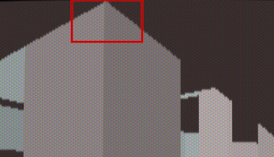

# Here comes the obnoxious "visplane"

Lets start with the following definition:

```c
// Now what is a visplane, anyway?
// 
typedef struct
{
  fixed_t		height;
  int			picnum;
  int			lightlevel;
  int			minx;
  int			maxx;
  // leave pads for [minx-1]/[maxx+1]
  byte		pad1;
  // Here lies the rub for all
  //  dynamic resize/change of resolution.
  byte		top[SCREENWIDTH];
  byte		pad2;
  byte		pad3;
  // See above.
  byte		bottom[SCREENWIDTH];
  byte		pad4;

} visplane_t;
```

And we'll start by clearing up some of the more simpler parts of it:
- `height` is either `floorheight` or `ceilignheight`
- `picnum` is an index number for a texture to use when drawing
- `lightlevel` is the sector lightlevel, this is used to scale up/down the texture
   brightness (via a palette)

Those three items are checked against to determine if a plane can be merged or if
a new one is required.


`minx` and `maxx` are the indexes to the start and end of the plane within the
`top` and `bottom` arrays. Where top and bottom contain the values of *where* in
screen space the spans/columns to be drawn start/stop. It can be visualised like
this when looking at the framebuffer:

```text
bottom[SCREENWIDTH] is the top of the screen, starting at y == 0
     _0___1___2___3___4___5___6___7___8___9___10__11__12__13__14__15__16__17__18__...
   0| -1, -1, -1, -1, -1, -1, -1, -1, -1, -1, -1, -1, -1, -1, -1, -1, -1, -1, -1, -1,
   1| -1, -1, -1, -1, -1, -1, -1, -1, -1, -1, -1, -1, -1, -1, -1, -1, -1, -1, -1, -1,
   2| -1, -1, -1, -1, -1, -1, -1, -1, -1, -1, -1, -1, -1, -1, -1, -1, -1, -1, -1, -1,
   3| -1, -1, -1, -1, -1, -1, -1, -1, -1, -1, -1, -1, -1, -1, -1, -1, -1, -1, -1, -1,
   4| -1, -1, -1, -1, -1, -1, -1, -1, -1, -1, -1, -1, -1, -1, -1, -1, -1, -1, -1, -1,
   5| -1, -1, -1, -1, -1, -1, -1, -1, -1, -1, -1, -1, -1, -1, -1, -1, -1, -1, -1, -1,
   6| -1, -1, -1, -1, -1, -1, -1, -1, -1, -1, -1, -1, -1, -1, -1, -1, -1, -1, -1, -1,
   7| -1, -1, -1, -1, -1, -1, -1, -1, -1, -1, -1, -1, -1, -1, -1, -1, -1, -1, -1, -1,
   8| -1, -1, -1, -1, -1, -1, -1, -1, -1, -1, -1, -1, -1, -1, -1, -1, -1, -1, -1, -1,
   9| -1, -1, -1, -1, -1, -1, -1, -1, -1, -1, -1, -1, -1, -1, -1, -1, -1, -1, -1, -1,
  10| -1, -1, -1, -1, -1, -1, -1, -1, -1, -1, -1, -1, -1, -1, -1, -1, -1, -1, -1, -1,
  11| -1, -1, -1, -1, -1, -1, -1, -1, -1, -1, -1, -1, -1, -1, -1, -1, -1, -1, -1, -1,
  12| -1, -1, -1, -1, -1, -1, -1, -1, -1, -1, -1, -1, -1, -1, -1, -1, -1, -1, -1, -1,
  13| -1, -1, -1, -1, -1, -1, -1, -1, -1, -1, -1, -1, -1, -1, -1, -1, -1, -1, -1, -1,
  14| -1, -1, -1, -1, -1, -1, -1, -1, -1, -1, -1, -1, -1, -1, -1, -1, -1, -1, -1, -1,
    | ...
top[SCREENWIDTH]
```

`R_RenderSegLoop` sets the values in the arrays by iteraating over the wall start/stop
range. For a ceiling it would insert in to `bottom[SCREENWIDTH]` at the *index* of
a value in the range start/stop, a value which is where the wall column *top* ends.

Thus an array of `bottom[-1,-1,-1,-1,-1,2,1,0,1,2,3]` would mean that the following
ceiling is drawn int he framebuffer:

```text
bottom[SCREENWIDTH] is the top of the screen, starting at y == 0
     _0___1___2___3___4___5___6___7___8___9___10__11__12__13__14__15__16__17__18__...
   0| -1, -1, -1, -1, FF, FF, FF, FF, FF, FF, -1, -1, -1, -1, -1, -1, -1, -1, -1, -1,
   1| -1, -1, -1, -1, FF, FF, -1, FF, FF, FF, -1, -1, -1, -1, -1, -1, -1, -1, -1, -1,
   2| -1, -1, -1, -1, FF, -1, -1, -1, FF, FF, -1, -1, -1, -1, -1, -1, -1, -1, -1, -1,
   3| -1, -1, -1, -1, -1, -1, -1, -1, -1, FF, -1, -1, -1, -1, -1, -1, -1, -1, -1, -1,
   4| -1, -1, -1, -1, -1, -1, -1, -1, -1, -1, -1, -1, -1, -1, -1, -1, -1, -1, -1, -1,
   5| -1, -1, -1, -1, -1, -1, -1, -1, -1, -1, -1, -1, -1, -1, -1, -1, -1, -1, -1, -1,
   6| -1, -1, -1, -1, -1, -1, -1, -1, -1, -1, -1, -1, -1, -1, -1, -1, -1, -1, -1, -1,
   7| -1, -1, -1, -1, -1, -1, -1, -1, -1, -1, -1, -1, -1, -1, -1, -1, -1, -1, -1, -1,
   8| -1, -1, -1, -1, -1, -1, -1, -1, -1, -1, -1, -1, -1, -1, -1, -1, -1, -1, -1, -1,
   9| -1, -1, -1, -1, -1, -1, -1, -1, -1, -1, -1, -1, -1, -1, -1, -1, -1, -1, -1, -1,
  10| -1, -1, -1, -1, -1, -1, -1, -1, -1, -1, -1, -1, -1, -1, -1, -1, -1, -1, -1, -1,
  11| -1, -1, -1, -1, -1, -1, -1, -1, -1, -1, -1, -1, -1, -1, -1, -1, -1, -1, -1, -1,
  12| -1, -1, -1, -1, -1, -1, -1, -1, -1, -1, -1, -1, -1, -1, -1, -1, -1, -1, -1, -1,
  13| -1, -1, -1, -1, -1, -1, -1, -1, -1, -1, -1, -1, -1, -1, -1, -1, -1, -1, -1, -1,
  14| -1, -1, -1, -1, -1, -1, -1, -1, -1, -1, -1, -1, -1, -1, -1, -1, -1, -1, -1, -1,
    | ...
top[SCREENWIDTH]
```

You could envision this as looking at a squre pillar in E1M1 perhaps, where the top
of the pillar looks like this, where the dark areas are the ceiling, which are `FF`
in the above example:


