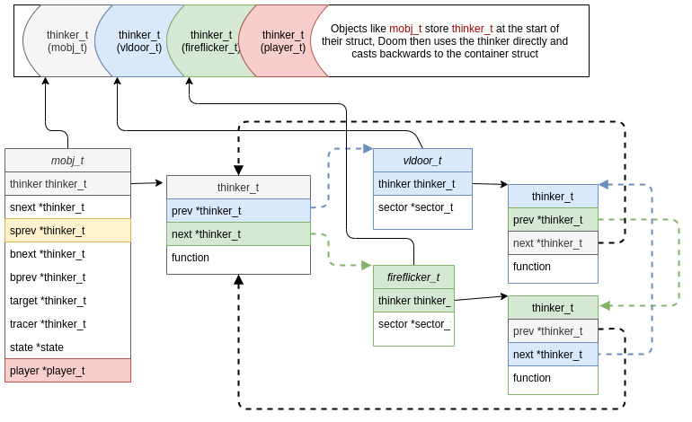
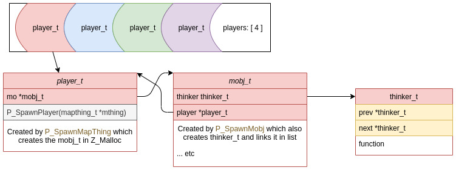

All objects that may interact, or change in any way are created with a `thinker_t` at their root. This is a `struct` that is essentially a linked list, but also contains a function pointer to run on the specific containing object:

```C
typedef struct thinker_s {
    struct thinker_s*	prev;
    struct thinker_s*	next;
    think_t		function;
    
} thinker_t;
```

A linked list provides a very fast way to iterate over objects that may not be in sequential order in contiguous memory. As almost all game objects are created using the Doom memory manager `Z_Malloc` this is a design requirement.

Use of a linked list like this means that either the allocation for objects must be stable (the objects position never changes), or the allocation manager (`z_malloc` in this case) is able to update linked-list pointers if they move.



In the game tic loop the linked list is iterated over, and each thinker's function is called with itself as the arg. C casts the self as the containing object to match the function arg signature. This is one source of frustration when trying to convert wholesale to Rust.

```C
typedef actionf_t  think_t;

typedef  void (*actionf_v)();
typedef  void (*actionf_p1)( void* );
typedef  void (*actionf_p2)( void*, void* );

typedef union {
  actionf_v	acv;
  actionf_p1	acp1;
  actionf_p2	acp2;

} actionf_t;
```

Some of the containers are simple enough, such as:

```C
typedef struct {
    thinker_t thinker;
    sector_t *sector;
    // other members removed for clarity
} vldoor_t;

typedef struct {
    thinker_t thinker;
    sector_t *sector;
    // other members removed for clarity
} fireflicker_t;
```

These have pointers to the sectors they affect, and the thinker function is relatively straightforward with a single function per object type out of a possible:

- ceiling_t
- vldoor_t
- floormove_t
- plat_t
- fireflicker_t
- lightflash_t
- strobe_t
- glow_t

It would be simple enough to either combine these in one, or have separate containers per type - though thinkers would have to be run for each.

Notice that `thinker_t` contains `think_t` which is the typedef alias for `actionf_t`, and this contains (usually) a `void (*actionf_p1)( void* )` pointer-to-function. The arg cast in the function, for example:

```C
door->thinker.function.acp1 = (actionf_p1)T_VerticalDoor;
...
void T_VerticalDoor(vldoor_t *door)
{
```

is what turns the `thinker_t` in to `vldoor_t`. Since the `thinker_t` is at the top of the `vldoor_t` struct layout, in memory the thinker can be cast and retain all of its data positioning. The door can also ref the thinker as it has a pointer.

TODO: diagram showing cast.

## Object creation

Many of the map objects are created via a multistep process.

1. Get the `Thing` from the wad file
2. Call a specific function related to type:
  -. `P_SpawnMapThing()`
    + `P_SpawnMobj()` or,
    +. `P_SpawnPlayer()` then calls,
      - `P_SpawnMobj()`
  - `P_SpawnPuff(x,y,z,type)`
- and so on...
3. Or call a number of special-case functions like `A_BFGSpray()`

All of these functions will call on the Doom memory manager:

```C
mobj = Z_Malloc(sizeof(*mobj), PU_LEVEL, NULL);
```

this means the object is now in the heap as shown in the first diagram, with a purge level of `PU_LEVEL` which means the object is to hang around for the duration of the level or until the object changes this itself.

The last step of `P_SpawnMobj()` (for example) is to run:

```C
	// set the thinker function callback
    mobj->thinker.function = P_MobjThinker;

    // add it to the thinker linked list
	P_AddThinker(&mobj->thinker);
	
    return (mobj);
```

`P_MobjThinker` is a function that is run in the `RunThinkers` tic. `P_AddThinker` inserts the thinker in the linked list.

### mobj_t

This is the problem struct, as it has pointers in to many places.

```C
typedef struct mobj_s {
    // List: thinker links.
    thinker_t thinker;
    // More list: links in sector (if needed)
    struct mobj_s *snext;
    struct mobj_s *sprev;
    // Interaction info, by BLOCKMAP.
    struct mobj_s *bnext;
    struct mobj_s *bprev;

    struct subsector_s *subsector;

    // Static array of data to determine mob type
    mobjinfo_t *info; // &mobjinfo[thing->type]

    // Static array of predefined states
    state_t *state;
    
    struct mobj_s *target;
    struct mobj_s *tracer;

    // Additional info record for player avatars only.
    // Only valid if type == MT_PLAYER
    struct player_s *player;
    // other members removed for clarity
} mobj_t;
```

These pointers may or may not be null. In the case of a `mobj_t` belonging to a player the player pointer is the address in memory of the player in a static array.

When a pointer is active, what it points to *must* live as long as the pointee. There is no way to define a max depth either so it is easy to create a pointer cycle.

Two pointers that are easy to deal with are `*info` and `*state` as these address a location in a static array only. `info` is used to build the object type. `state` contains another function pointer which is used within the thinker function (if it's a player/sprite/light).

```C
typedef struct {
    spritenum_t sprite;
    int frame;
    int tics;
    // void (*action) ();
    actionf_t action; // recall that this is a function pointer
    statenum_t nextstate;
    int misc1;
    int misc2;
} state_t;
```

**Call tree of state function**

- `P_MobjThinker(mobj_t *mobj)`
  + -> may remove thinker/object from list and mark memory as purgable
  + -> `P_SetMobjState(mobj, mobj->state->nextstate)`
    - -> `st->action.acp1(mobj)`

Here a possible `acp1` funtion pointer might be:

```C
void A_VileTarget(mobj_t *actor) {
    mobj_t *fog;

    if (!actor->target)
        return;

    A_FaceTarget(actor);

    fog = P_SpawnMobj(actor->target->x,
                      actor->target->x,
                      actor->target->z, MT_FIRE);

    actor->tracer = fog;
    fog->target = actor;
    fog->tracer = actor->target;
    A_Fire(fog);
}
```

you can see the pointers being followed here. This function also spawns `MT_FIRE` with `P_SpawnMobj()`. This means that another `mobj_t/thinker_t` will be `Z_Malloc`ed and inserted in the linked list. It then calls `A_Fire(fog)` with that new object.

Can you see how it becomes difficult to prove data lifetimes, let alone getting mutability correct?

### Player

Lastly, the player is a special case. Made up of 3 different structs and having a cyclic pointer link between player and mobj:



# Other info

Functions called for each object types thinker:

**ceiling_t**
```C
ceiling->thinker.function.acp1 = (actionf_p1)T_MoveCeiling;
```

**vldoor_t**
```C
door->thinker.function.acp1 = (actionf_p1)T_VerticalDoor;
```

**floormove_t**
```C
floor->thinker.function.acp1 = (actionf_p1)T_MoveFloor;
```

**plat_t**
```C
plat->thinker.function.acp1 = (actionf_p1)T_PlatRaise;
```

**fireflicker_t**
```C
flick->thinker.function.acp1 = (actionf_p1)T_FireFlicker;
```

**lightflash_t**
```C
flash->thinker.function.acp1 = (actionf_p1)T_LightFlash;
```

**strobe_t**
```C
flash->thinker.function.acp1 = (actionf_p1)T_StrobeFlash;
```

**glow_t**
```C
g->thinker.function.acp1 = (actionf_p1)T_Glow;
```

**mobj_t**
```C
mobj->thinker.function.acp1 = (actionf_p1)P_MobjThinker;
```

*each of these objects owns the function*.

# Rusting

It's not easy to rustify this scheme without some trade-offs. First let's look at an array of thinkers, just the thinker struct on its own. Then look at maintaining pointers to the objects that need to think.

In rust anything using pointers (raw) needs a guarantee that the pointed-to thing won't move. In the case of a `Vec`, the allocation will always move to resize if space is exceeded, thus invalidating pointers. Also consider that rust doesn't naturally do casting for different non-concrete types and so needs specific new `Vec` for each type - given that vecs re-alloc this is a non-starter.

So we have pointers, differently sized objects and types, and a need to keep data in one place even when new data is added. What do we do?

There's unsafe rust using as much safe as we can, then there's transliterating `z_malloc`.

Unsafe rust is great, it allows you to do many cool things. But the caveat is you must keep in mind the contracts you write for this code. In most cases you can wrap the unsafe with safe code, so long as the contracts of that unsafe code are obeyed in the wrapping. This also goes for `z_malloc`.


### The criteria
We need to keep the ordering that Doom creates map objects. This rules out doing something simple and easy like a plain Vector since this moves on realloc or item removal - a vector can potentially change the object order and thus the Thinker order, resulting in possible different game states in recorded demos.

We need:
1. Linked list access
2. Stable allocations
3. Objects and Thinkers need access to each other

This leaves two options - use a malloc with a certain size (hopefully enough) and something like a:
```rust
struct Thinker {
  next,
  prev,
  obj: ObjectTypeEnum
}
```

where each Object also needs to store a pointer to the Thinker that owns it. `ObjectTypeEnum` is to be a container enum which guarantees that the largest member is the size that will be used for every Object in the allocation - this simplifies quite a bit at the cost of more memory used.

Or we can go full `z_malloc` and custom manage all allocs. Lets see if we can discount `z_malloc` first.

`z_malloc` allocates a large block of memory, then manages data within it manually. The request for z_malloc to alloc a block is managed via the object creator, it is then added to the linked list and within this list node is a pointer to the owner of the data - this is important as when the `z_malloc` needs to compact or move allocations, it must be able to update the owners links to where its data is in memory. With Rust this poses many ownership issues, most of which can be overcome easily with unsafe code given that the data owner is the thinker+object - but it then becomes harder to prove correctness. There is a lot of overhead in management and working within rust rules that makes an alternative approach easier.

### The solution

It's not possible to (easily) do what was done with C and transmute to/from Thinker to Object by virtue of the data structure. For one; Rust makes no guarantees about layout unless we use `#[repr(c)]` to enforce a C style strict layout, and two; I wanted to skip the manual management of blocks and block sizes, so to do this the objects (such as monsters, lights) need to be in a container that can own the data.

#### Thinker

The thinker struct ended up as:

```rust
pub struct Thinker {
    prev: *mut Thinker,
    next: *mut Thinker,
    data: ThinkerData,
    func: fn(&mut Self, &mut Level) -> bool,
}
```

`*mut Thinker` are the pointers to others in the linked list. `ThinkerType` is an enum that own the object data and lets us easily have multiple types of data. This part is the important part as it means that every item in the allocation is the same size. Finally `func` is a function pointer to the function that should run on `think()`.

There are many thinker types, the names a descriptive:

```rust
pub enum ThinkerData {
    TestObject(TestObject),
    MapObject(MapObject),
    VerticalDoor(VerticalDoor),
    FloorMove(FloorMove),
    CeilingMove(CeilingMove),
    Platform(Platform),
    LightFlash(LightFlash),
    StrobeFlash(StrobeFlash),
    FireFlicker(FireFlicker),
    Glow(Glow),
    /// The thinker function should set to this when the linked-list node
    /// and memory is no-longer required. On thinker run it will be set to
    /// `Free` and unlinked.
    Remove,
    /// Used to mark a `ThinkerAlloc` slot as free to be re-used.
    Free,
}
```

#### ThinkerAlloc
